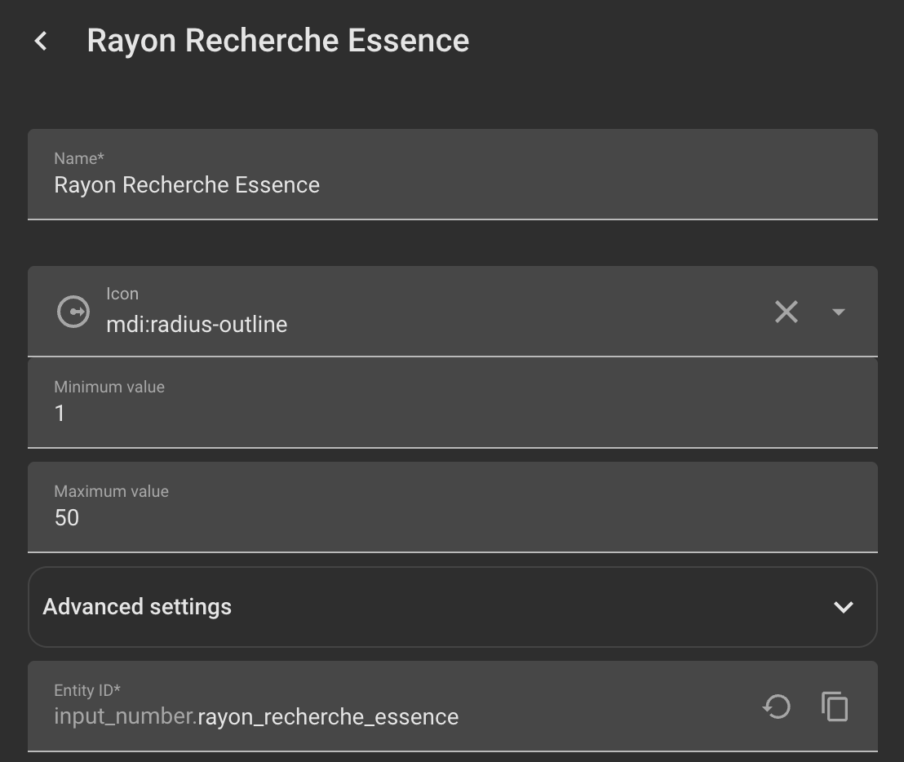
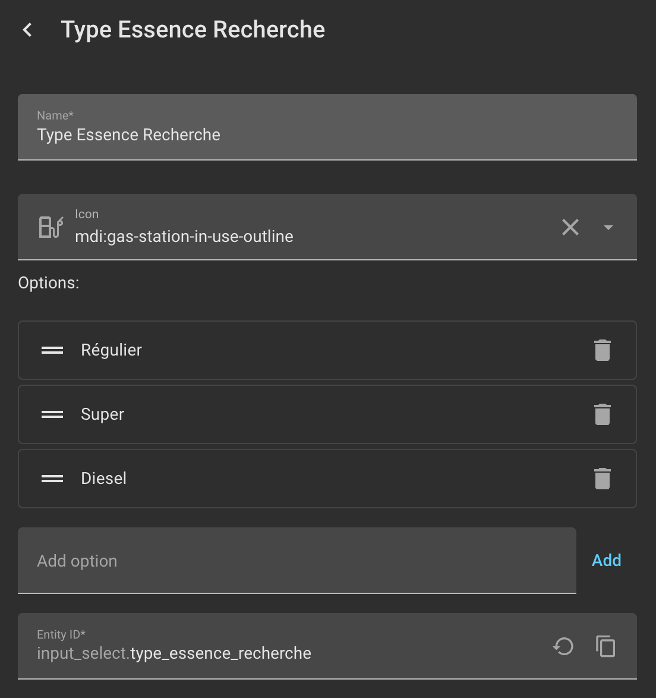

# ⛽ Régie Essence Québec pour Home Assistant

Une intégration personnalisée pour Home Assistant qui récupère en temps réel les prix de l'essence au Québec, directement depuis les données ouvertes de la Régie de l'énergie du Québec.

## ✨ Fonctionnalités

* **Configuration simple (UI) :** Fini le YAML ! Cherchez et sélectionnez votre/vos station directement via des menus déroulants (Région > Ville > Bannière > Station). Sinon, via la recherche avancée qui permet de voir toute les stations d'une bannière par exemple ou en écrivant l'adresse directement (match partiel possible)
* **Trois types de carburant :** Crée automatiquement des capteurs pour l'essence Ordinaire, Super et le Diesel.
* **Mise à jour paramétrable :** Choisissez la fréquence de rafraîchissement (par défaut : 60 minutes, minimum : 5 minutes).
* **Coordonnées GPS intégrées :** Les capteurs incluent la latitude et la longitude, permettant une intégration native avec la carte (Map) de Home Assistant.
* **Moteur de recherche intelligent :** Inclut un service personnalisé (`regie_essence_quebec.find_closest_stations`) capable de calculer en temps réel les stations les plus proches ou les moins chères dans un rayon donné autour de vous !
* **Notification sur écran de navigation et lien avec app de navigation (iphone/carplay à tester)

---

## Installation

### Méthode 1 : Via HACS (Recommandé)

[](https://my.home-assistant.io/redirect/hacs_repository/?owner=moimeme81&repository=essence-quebec-home-assistant&category=integration)

1. Ouvrez HACS dans Home Assistant.
2. Cliquez sur **Intégrations**.
3. Cliquez sur les 3 petits points en haut à droite et sélectionnez **Dépôts personnalisés** (Custom repositories).
4. Ajoutez l'URL de ce dépôt GitHub (`https://github.com/moimeme81/essence-quebec-home-assistant`) et choisissez la catégorie **Intégration**.
5. Cliquez sur **Télécharger** (Download).
6. Redémarrez Home Assistant.


### Méthode 2 : Manuelle

1. Téléchargez le contenu de ce dépôt.
2. Copiez le dossier `custom_components/regie_essence_quebec` dans le dossier `custom_components` de votre configuration Home Assistant.
3. **Redémarrez Home Assistant**.

## ⚙️ Configuration

1. Allez dans **Paramètres** > **Appareils et services**.
2. Cliquez sur **+ Ajouter une intégration**.
3. Cherchez **Régie Essence Québec**.
4. Laissez-vous guider par les menus pour trouver la station que vous souhaitez surveiller.
5. C'est fait ! Un nouvel appareil sera créé avec vos capteurs de prix.
*Note : Vous pouvez ajouter l'intégration plusieurs fois si vous souhaitez surveiller plusieurs stations spécifiques.*

---


## 🚀 Utilisation Avancée

### 1. Affichage sur une carte (Map Card)
Puisque les capteurs incluent les attributs `latitude` et `longitude`, vous pouvez afficher votre station directement sur une carte dans votre tableau de bord. Cliquer sur l'icône affichera le prix actuel !

```yaml
type: map
title: Ma Station d'Essence
default_zoom: 14
entities:
  - entity: sensor.votre_station_ordinaire
```

### 2. Le Service "Trouver les plus proches / moins chères"
L'intégration ajoute un service puissant nommé `regie_essence_quebec.find_closest_stations`.
En lui fournissant vos coordonnées GPS actuelles (via votre téléphone ou votre zone "Maison"), il calcule la distance avec toutes les stations du Québec et vous renvoie les meilleures options.

Options configurables du service :

`latitude` / `longitude` : Vos coordonnées de départ.

`limit` : Nombre de stations à retourner (ex: 3).

`radius` : Rayon de recherche en kilomètres (ex: 10). 

`gas_type` : Type d'essence recherché (`Régulier`, `Super`, ou `Diesel`).

#### helpers:

il est possible de définir des helpers qui déterminent le type d'essence recherché et le rayon de recherche

<table>
  <tr>
    <td valign="top" align="center">
      <p>Helper rayon de recherche:</p>
      
      <p>Remplacer la valeur de "radius" par: "{{ states('input_number.rayon_recherche_essence') | float }}"</p>
    </td>
    <td valign="top" align="center">
      <p>Helper type d'essence:</p>
      
      <p>Remplacer la valeur de "gas_type: par "{{ states('input_select.type_essence_recherche') }}"</p>
    </td>
  </tr>
</table>


### 3. Scripts : Notifications Interactives avec Android Auto / Google Maps
Voici deux scripts prêts à l'emploi que vous pouvez ajouter à votre Home Assistant.
Ils utilisent la géolocalisation de votre téléphone pour trouver l'essence autour de vous, et vous envoient une notification avec des boutons cliquables pour lancer directement la navigation GPS vers la station choisie !

⚠️ Important : Remplacez `sensor.votre_telephone` et `notify.mobile_app_votre_telephone` par les vraies entités de votre appareil.

## Blueprint Notification

Blueprint permettant la notification de votre appareil mobile. Les notifications sont acctionable (max 3) et vous dirige vers la station désiré en utilisant google maps

[](https://my.home-assistant.io/redirect/blueprint_import/?blueprint_url=https%3A%2F%2Fraw.githubusercontent.com%2Fmoimeme81%2Fessence-quebec-home-assistant%2Fmain%2Fblueprint%2Fscript%2Ffind_gas.yaml)

## À faire
- [ ] Ajouter les logo des marque
- [x] Créer des blueprint
- [ ] Ajouter sensor de tendance
- [ ] Consolider traduction
- [ ] Automatisation de zone et de proximité
- [ ] Ajout de possibilités de conversion de devise (utile pour les touriste)


## Mentions légales
Cette intégration n'est pas affiliée à la Régie de l'énergie du Québec ni au gouvernement du Québec. Elle extrait simplement les données publiques rendues disponibles sur leur carte interactive.
